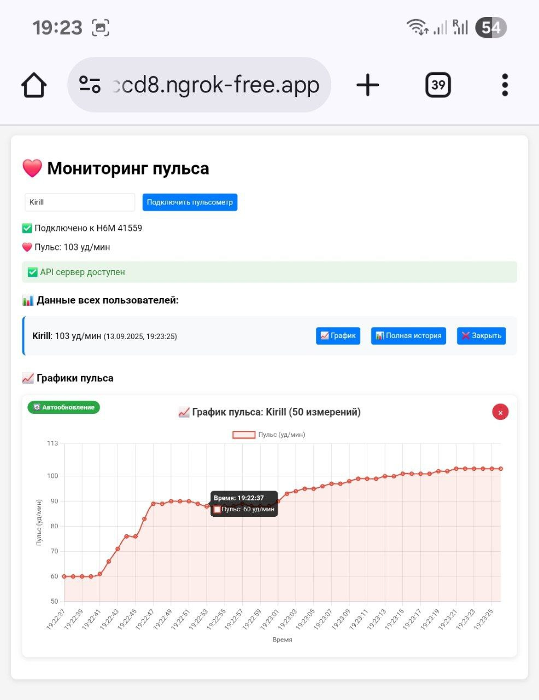

# Heart Rate Monitor Web Application
## Test/study web app made with AI

A real-time heart rate monitoring web application that connects to Bluetooth heart rate devices and displays live data with interactive charts.




## Features

- 🔗 **Bluetooth Connectivity**: Connect to heart rate monitors via Web Bluetooth API
- 📊 **Real-time Monitoring**: Live heart rate display with automatic updates
- 📈 **Interactive Charts**: Visualize heart rate data with Chart.js graphs
- 📱 **Multi-user Support**: Track multiple users simultaneously
- 📱 **Responsive Design**: Works on desktop and mobile devices
- 💾 **Auto-refresh**: Automatic data updates every 5-10 seconds
- 💾 **Data Persistence**: Stores heart rate history in memory

## Technology Stack

### Backend
- **Node.js** with Express.js
- **CORS** enabled for cross-origin requests
- **RESTful API** for data management
- **In-memory storage** for heart rate data

### Frontend
- **Vanilla JavaScript** with Web Bluetooth API
- **Chart.js** for data visualization
- **Responsive CSS** design
- **Real-time updates** via fetch API

## Prerequisites

- Node.js (v14 or higher)
- Modern web browser with Web Bluetooth support (Chrome, Edge, Opera)
- Bluetooth heart rate monitor device

## Installation & Setup

1. **Clone the repository**
   ```bash
   git clone <repository-url>
   cd heart-rate
   ```

2. **Install dependencies**
   ```bash
   cd backend
   npm install
   ```

3. **Start the server**
   ```bash
   npm start
   ```
   The server will start on port 8080.

4. **Access the application**
   - Open your browser and navigate to `http://localhost:8080`
   - Or use ngrok for external access:
     ```bash
     ngrok http 8080
     ```

## Usage

1. **Enter your name** in the input field
2. **Click "Connect Heart Rate Monitor"** to pair with your Bluetooth device
3. **Grant Bluetooth permissions** when prompted by your browser
4. **Select your heart rate device** from the available devices list
5. **View real-time data** and charts as your heart rate is monitored

## API Endpoints

### Health Check
- `GET /api/health` - Check server status

### User Management
- `GET /api/users` - Get all users and their latest heart rate
- `GET /api/users/:name` - Get specific user's current heart rate
- `GET /api/users/:name/history?limit=50` - Get user's heart rate history

### Data Storage
- `POST /api/heart-rate` - Save heart rate data
  ```json
  {
    "name": "John Doe",
    "heartRate": 75
  }
  ```

## Browser Compatibility

This application requires a modern browser with Web Bluetooth support:
- ✅ Chrome 56+
- ✅ Edge 79+
- ✅ Opera 43+
- ❌ Firefox (not supported)
- ❌ Safari (not supported)

## Security Notes

- The application uses CORS with wildcard origin (`*`) for development
- Data is stored in memory and will be lost on server restart
- For production use, consider implementing proper authentication and data persistence

## Development

### Project Structure

```
heart-rate/
├── backend/
│   ├── package.json
│   └── server.js          # Express server with API endpoints
├── front/
│   └── index.html         # Frontend application
└── README.md
```

### Key Features Implementation

- **Web Bluetooth Integration**: Uses `navigator.bluetooth.requestDevice()` to connect to heart rate monitors
- **Real-time Data**: Automatic notifications from Bluetooth characteristics
- **Chart Visualization**: Chart.js integration with auto-updating graphs
- **Multi-user Support**: Separate data storage for each user

## Troubleshooting

### Common Issues

1. **Bluetooth not available**
   - Ensure you're using a supported browser
   - Check that Bluetooth is enabled on your device

2. **Device not found**
   - Make sure your heart rate monitor is in pairing mode
   - Try refreshing the page and attempting connection again

3. **API connection errors**
   - Verify the server is running on port 8080
   - Check browser console for CORS or network errors

## Contributing

1. Fork the repository
2. Create a feature branch
3. Make your changes
4. Test thoroughly
5. Submit a pull request

## License

This project is licensed under the ISC License.

## Future Enhancements

- [ ] Database integration for persistent storage
- [ ] User authentication system
- [ ] Export data functionality
- [ ] Mobile app development
- [ ] Advanced analytics and insights
- [ ] Push notifications for abnormal heart rates
